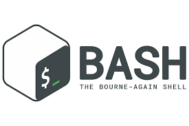

<!--  -->
<!-- <h3 class="animate__animated animate__bounce">Hi, I'm Zahir Ekrem. I'm fullstack and mobil  developer.👋<h3/> -->
## Hi there 👋

<h2> Zahir Ekrem is here. </h2>

<h4> Full-Stack & React & React Native Developer  </h4>

 

## Knowledge always in my scope !!!

 
<<<<<<< HEAD
## 🚀 Skills

   
  
  
  
  
  
  
  
  
  
  
  
  
 <!--   -->
 
 
 <!--   -->
  
  
 <!--   -->
  
  
  
  
  
  
 <!--   -->
  
 <!--   -->
 
 

## 💻 OS

 
 

## 👨👩 Social

## 📈 Statistics

<!-- 

 -->

&nbsp;
 

<!--  -->
=======
<!--       

<!-- 
My Tools :

 -->

<!-- 
 -->

